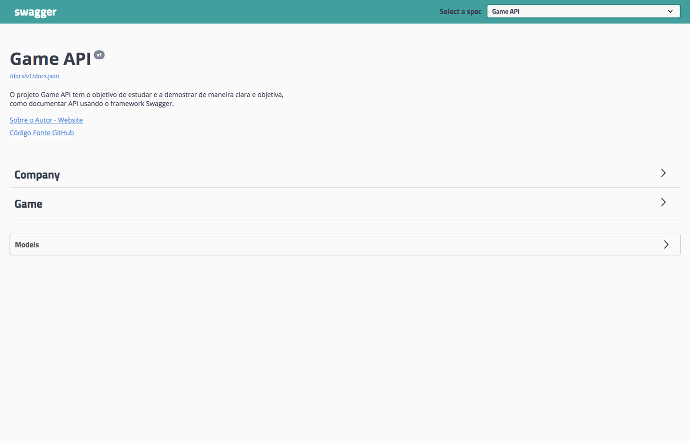
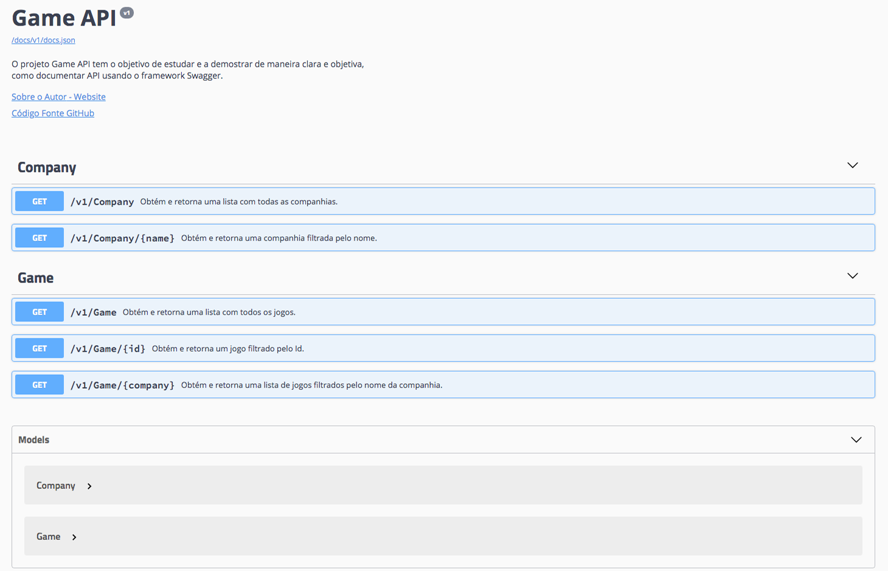
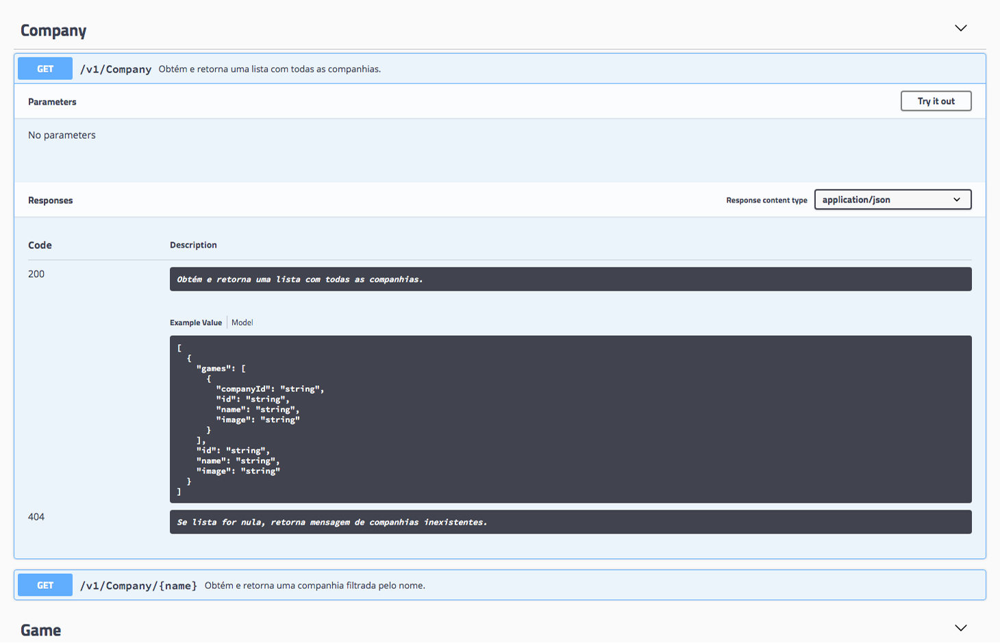
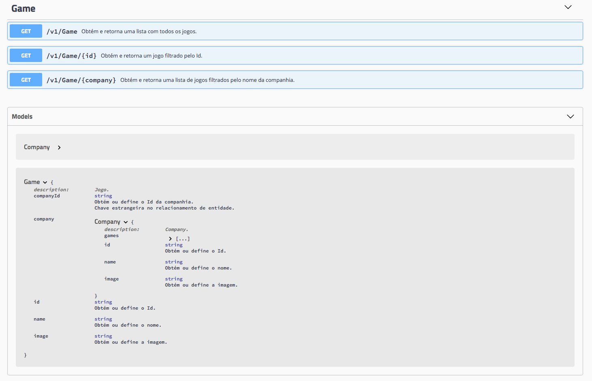

# Game API
Olá, esse é o repositório da Game API, aqui você vai encontrar um exemplo de como documentar um serviço web utilizando o framework Swagger.

## Tecnologias Implementadas
* ASP.NET Core 2.1.4
* Visual Studio Code
* Swashbuckle.AspNetCore.Swagger

## Sobre a API
O foco foi demonstrar como documentar uma API no ASP.NET Core usando o Swagger, por isso, o escopo abrange somente os métodos de leitura.

O serviço trabalha em cima de um mock, portanto, não há integração com banco de dados. Se essa for a sua busca, acesse o [repositório contact-api](../../../contact-api). Nesse estudo abordo acesso a dados com Entity Framework Core.

## Sobre Resultado

#### *Layout Customizado* ####

#### *Lista dos Métodos e Entidades* ####

#### *Detalhe das Chamadas* ####

#### *Detalhe das Entidades* ####

